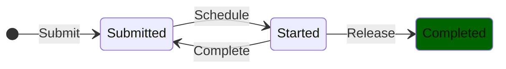

# ArmoniK Modeling Using TLA+

## Introduction

**ArmoniK** is a production-grade system with a complex codebase, components, and configurations. The purpose of this TLA+ specification is to formally describe the existing system, ensuring correctness and clarity. Since ArmoniK was developed without prior formal specification, many aspects require clarification and justification.

This document discusses and documents the assumptions and modeling choices made to formalize ArmoniK’s design and algorithms. It details the model design based on the actual implementation, specifying and justifying omissions and simplifications.

> **ℹ️ NOTE**
> The state-of-the-art modeling approach in TLA+ is iterative refinement. We start with an abstract description of ArmoniK’s operation and progressively refine it.

---

## Table of Contents

* [An Abstract Decentralized Online Scheduling System](#an-abstract-decentralized-online-scheduling-system)

---

## An Abstract Decentralized Online Scheduling System

At a high level, ArmoniK can be seen as a **decentralized online task scheduler**. It consists of a set of **Scheduling Agents** (whose number is unknown and may vary over time) responsible for executing tasks submitted to the system.

System constraints:
- **Task Submission**: New tasks can be submitted at any time. Each task must be unique and cannot be submitted more than once.
- **Task Acquisition**: An agent can acquire a set of available tasks (uncompleted and not being processed by any other agent) for execution.
- **Task Release**: An agent can release all or part of the tasks it is processing, making them available again.
- **Task Completion**: An agent can complete all or part of the tasks it is processing, notifying the system to avoid future re-executions.

System properties:
- **Exclusivity**: A task cannot be executed simultaneously by two distinct agents.
- **Completion**: Every submitted task must eventually be completed.
- **Persistence**: Once completed, a task remains completed forever.

> **ℹ️ REMARK**
> A *task* abstracts a request to perform a computation, i.e., executing a set of instructions.

**A status is associated with each task to track its position in the scheduling process.** Based on the previous informal description, it is possible to scheme the life-cycle of a task as shown in the following figure.

**In this diagram, each state corresponds to a given status for a task, and the transitions describe the system as a transition system.** This transition system, associated with the desired properties, is specified in [SimpleTaskScheduling](../specs/SimpleTaskScheduling.tla).

> **ℹ️ NOTE**
> The set of tasks and agents is represented by unique identifiers from an implicit, potentially infinite set. For model checking, these sets are materialized and made finite. A dedicated specification, [MCSimpleTaskScheduling](../specs/MCSimpleTaskScheduling.tla), introduces a dummy terminating action to avoid deadlocks.

---

Here’s the corrected and expanded section for **Considering Task Inputs/Outputs**, restoring the two-step refinement and clarifying the role of task I/Os:

---
