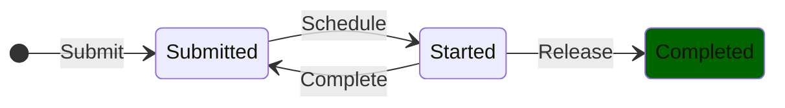
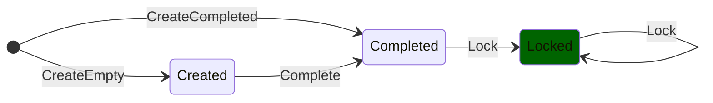

# ArmoniK Modeling Using TLA+

**WARNING: This document is a draft. It may not be up to date with the specifications.**

ArmoniK is an existing production-grade system that comprises many lines of code, components and configurations. The purpose of the TLA+ specification is to converge toward the description of the existing system while ensuring correctness. As the system has been developed withou prior formal specification, many aspects need to be precised. 

The aim of this document is therefore to discuss and document the assumptions and modeling choices adopted to formalize ArmoniK's design and algorithms. In particular, it details the model design based on the actual implementation, specifying and justifying the omissions and simplifications made.

When using TLA+, the state of the art modeling approach is iterative through refinement. This is the approach we are about to adopt. We'll start by describing ArmoniK's operation as abstractly as possible, and then move on step by step to a more detailed description.

## Table of Contents

## An Abstract Decentralized Online Scheduling System

At the high-level ArmoniK can be seen as a decentralized online task scheduler. It consists of a set of agents known as Scheduling Agents (whose number is unknown and may vary over time) responsible for executing tasks submitted to the system over time.  The constraints of such a system are as follow:

* New tasks can be submitted at any time. As this is an online scheduler, the system can be requested at any time to execute a new set of tasks. The only constraint is that these tasks must be new, i.e. distinct from previously submitted tasks. In other words, tasks are unique and cannot be submitted several times (although this does not mean that the same computation cannot be performed several times).
* An agent can acquire a set of available tasks (i.e. uncompleted tasks that are not being processed by any other agent) in order to proceed with their execution. To guarantee efficiency, the system seeks to carry out as little work as possible by avoiding performing the same task several times.
* An agent can release all or part of the tasks it is processing, making them available again. An agent may decide it is enable to execute the task for any reason. In particular, this constraint abstracts many failure scenarios like the crash of the agent. Future refinements will clarify the need for task releasing.
* An agent can complete all or part of the tasks it is processing. When an agent completes the processing of tasks, it notifies it for an eventual user or to avoid future re-executions.

The system must be designed to guarantee the following properties:
* A task cannot be executed simultaneously by two separate agents.
* Any task submitted must be finally completed.
* Once completed a task remains completed forever.

> **Remark**: A task abstracts a request of performing a compution i.e executing a set of instructions.

A status is associated to each task to track its position in the scheduling process. Based on the previous informal description, it is possible to scheme the life-cycle of a task as shown on the following figure.

In this diagram each state correspond to a given status for a task and the transitions describe the system as a transition system. This transition system associated with the desired properties is specified in [SimpleTaskScheduling](../specs/SimpleTaskGraphScheduling.tla).

> **Note**: One of the difficulties in writing the specification is that you have to be able to write the set of tasks, which is proiri infinite. Similarly, the set of agents is unknown and potentially very large. In both cases, we represent a task (respectively an agent) by a unique identifier taken from any set. The set of task (respectively agent) identifiers is not explicitly described and is given as a constant in the specification. This corresponds to describing the system as being parameterized with two parameters.

> **Note**: To model check the specification, both task and agent identifier sets must be materialized and finite. During model checking, as the number of task is finite, the system reaches an unrelevant deadlock when all tasks have been executed. To overcome this, a dedicated specification extends the previous for model-checking purpose and introduce a dummy terminating action that avoid the deadlock. This specification is [MCSimpleTaskScheduling](../specs/MCSimpleTaskScheduling.tla).

## Considering Task Inputs/Outputs

The previous description omits tasks I/Os that play a central role in ArmoniK as they are used to express dependencies between tasks. Indeed a task perform computation on data, it consumes inputs to produce outputs. Data are the counterparts of tasks, in that their processing is comparable to that of tasks, and the properties associated with their process are complementary to those associated with tasks. The previous specification can therefore be refined to integrate tasks I/Os into the description.

To simplify and clarify this refinement we do it in two steps:
1. We write an abstract specification that states how data are processed.
2. We write a refined specification that states tasks scheduling with their I/Os.

> **Remark**: Just as a task abstracts the notion of computation, we need an abstraction of the notion of data. This abstraction is called *object* and encapsulates all the information relating to a particular piece of data.

### Abstract Object Processing

As with tasks, we're not interested in the value of the data, but in the way it's processed by the system. This is what object abstraction is for. In the following, we'll only be talking about objects.

From the high-level ArmoniK manages a collection of individual objects identified by à unique identifier. Regarding these objects it enforces the following constraints:
* An object can be created empty. An empty object simply means that there exists a container for a data but this data is not yet available.
* An empty object can be completed. It means that at any time an empty object can be completed by providing its data.
* An object can be created completed. It means that the object is provided with its data when created. (This corresponds to the composition of the two previous actions. It seems less relevant and will probably removed in future versions of the specification.)
* A completed object can be locked to forbid its overwriting. Once a data is consumed, we don't want it to be modified as it could lead to unexpected behaviors in the computation.

The system design must guarantee the following properties:
* All object must eventually be completed.
* Once locked an object remains locked forever i.e it cannot be overwritten (= returning to the completed state).

> **Note**: (Move this note to rational of locking constraint) In the early drafts of the specification, objects were supposed to be immutable. However, this poses an obvious problem when considering failures during task execution. Indeed, if a task crashes after writing its first result, it must be able to overwrite it during future executions (unless the object is cloned, which poses other problems). The immutability property was therefore abandoned in favor of object locking.

Like with data, a status is associated to each object to track its processing state. Based on the previous informal description, it is possible to scheme the life-cycle of an object as shown on the following figure.

In this diagram each state correspond to a given status for an object and the transitions describe the system as a transition system. This transition system associated with the desired properties is specified in [SimpleObjectProcessing](../specs/SimpleObjectProcessing.tla).

> **Note**: SimpleObjectProcessing specification also uses an implict set for object identifiers. A dedicated specification [MCSimpleObjectProcessing](../specs/MCSimpleObjectProcessing.tla) is used for model-checking.

### Abstract task scheduling with I/Os

## Adding task dependencies

The task scheduling system specified above only deals with independent tasks. We now couple task scheduling with object processing while precising relevant constraints to describe the scheduling of dynamic task graphs. This new specification is a refinement of the SimpleTaskScheduling specification.

A decentralized dynamic task graph scheduler is a system similar to the one described above, but in which tasks consume and produce data represented by objects. This data is used to account for the dependencies between tasks (and therefore their order of execution). A key aspect of this system is that it allows submission of tasks and objects at runtime leading to restructuring of the task graph. Some guards must be enforced to ensure consistency and avoid deadlocks. This system inherits the constraints and properties of both SimpleTaskScheduling and SimpleObjectProcessing to which are added:
- The task and object dependencies forms a bipartite directed-acyclic graph whose roots and leaves are objects and where every objects has at most a single predecessors (i.e an object is completed either by environment or produced by a single task). **Rational**: It guarantees that every task has at least one input and one output object and that tasks cannot deadlock because of circular dependencies.
- Task dependencies once submitted can't be modified.
- A task can be schedule once all its input objects are completed.
- Once consumed, objects are locked i.e once a task having it as input is scheduled.
- A task cannot complete until all its output objects are completed. It may occurs later however.
- Task dependencies can be resolved only after its completion. Task resolution consists in submitting newly ready tasks.
- When a task dynamically submit a sub graph the following must hold: tasks can take any existing or newly created object as input and have any new object as output or those of the parent task performing subtasking. In particular it is forbidden for a task to become the parent of other existing objects.
- Add the constraints related to subtasking.

The system must guarantee the following properties:
* The task graph is always consistent (has the required structure).
* 
* Refines the two previous specifications.

**Thoughts**:
- Tasks and data must be processed in the order defined by the task/data graph (topological sorting? Historical variable?).
- See if it is possible to draw a state diagram inspring from automata composition.

**IMPORTANT**: In all the spec described so far, tasks, objects and agents are identified by labels called identifiers. Swapping these labels doesn't change the behavior of the system. This encourage to use symetry reduction.
