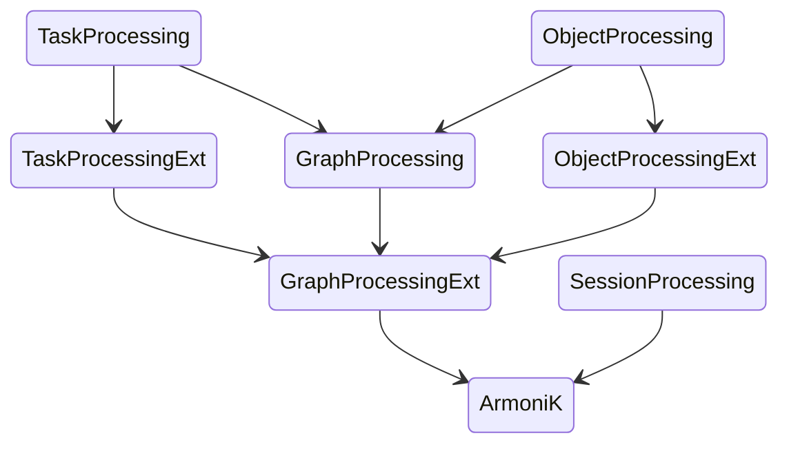

# ArmoniK TLA+ Specification

**Formal specification of ArmoniK's scheduling algorithm using TLA+**

This repository contains the [TLA+](https://lamport.azurewebsites.net/tla/tla.html) specification for **ArmoniK**, a fault-tolerant, distributed scheduler designed to execute complex task graphs on elastic and unreliable infrastructures.

The goal of this specification is to:
- Capture the core logic of ArmoniK in a precise and verifiable way
- Validate key correctness and fault-tolerance properties
- Improve confidence in the system's reliability and robustness

## What is ArmoniK?

ArmoniK is a high-performance orchestration system for distributed DAG-based workloads. It efficiently schedules and executes tasks across dynamic and potentially crash-prone compute nodes.

## What is TLA+?

[TLA+](https://lamport.azurewebsites.net/tla/tla.html) (Temporal Logic of Actions) is a formal specification language developed by Leslie Lamport. It is used to design, model, document, and verify concurrent and distributed systems.

TLA+ is designed to:
- Model complex system behavior with simple mathematics;
- Check safety and liveness properties;
- Discover subtle bugs *before* implementation.

## Repository contents

Arrows on the figure illustrate the "is refined by" relation.

## How to use this repository?

## References

* [ArmoniK Project](https://github.com/aneoconsulting/ArmoniK)
* [TLA+ Home Page](https://lamport.azurewebsites.net/tla/tla.html)
